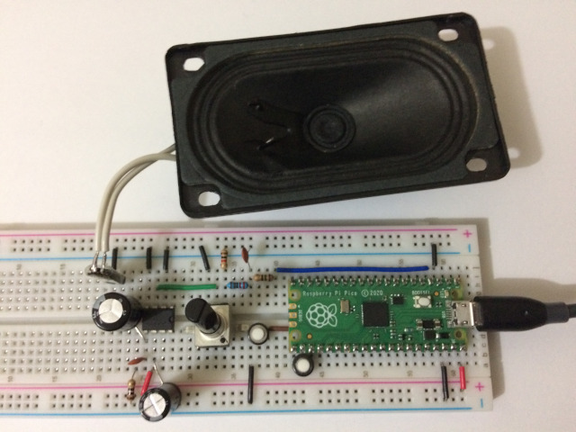
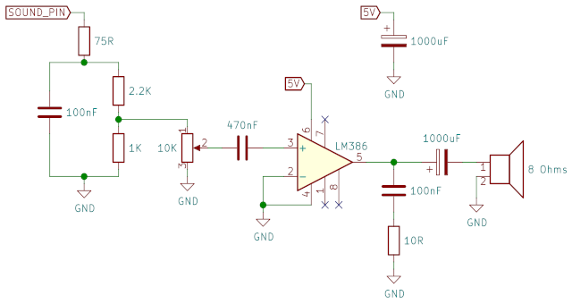
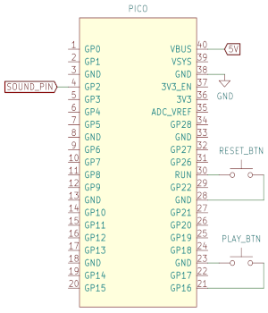

# pico-audio-demo

This is an audio output demo using the Raspberry Pi Pico with an LM386
amplifier to produce sound using a 8Ω speaker.

This code is based on the PWM/DMA code described in [this blog
post](https://gregchadwick.co.uk/blog/playing-with-the-pico-pt3/) by
Greg Chadwick.

It uses 8-bit PWM samples at 22050 Hz with a mixer to play up to 4
sounds at the same time (this number can be changed easily in the
source code).

A synth loop (by Stereo Surgeon) is played in loop, and pressing the
button connected to the Pico's GP16 pin triggers a small drum sound
(by EKVelika).

There are the schematics for the sound amplifier and the Pico
connections:

NOTE: the 75Ω resistor connected to the `SOUND_PIN` was originally
68Ω, and the 100nF capacitor at the output of the LM386 was originally
a 100nF. I made the changes because I didn't have the original values
available, but everything seems to work fine.

### Attributions

This code includes parts of Greg Chadwick's [PWM audio
code](https://github.com/GregAC/pico-stuff/tree/main/pwm_audio)
described in [this blog
post](https://gregchadwick.co.uk/blog/playing-with-the-pico-pt3/).

It also includes mono/22050 Hz conversions of the following sounds released under Creative Commons:

- "Analog vintage Loop" by EKVelika (CC BY 3.0 License) - [https://freesound.org/people/EKVelika/sounds/251248/](https://freesound.org/people/EKVelika/sounds/251248/)
- "Insomniac Snyth Loop.wav" by Stereo Surgeon (CC0 1.0 License) - [https://freesound.org/people/Stereo%20Surgeon/sounds/261208/](https://freesound.org/people/Stereo%20Surgeon/sounds/261208/)
